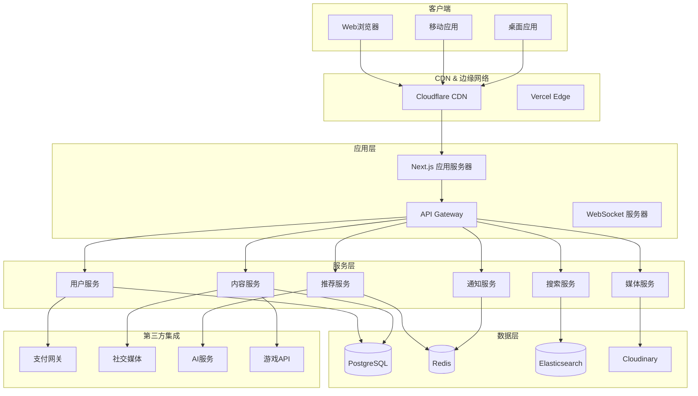
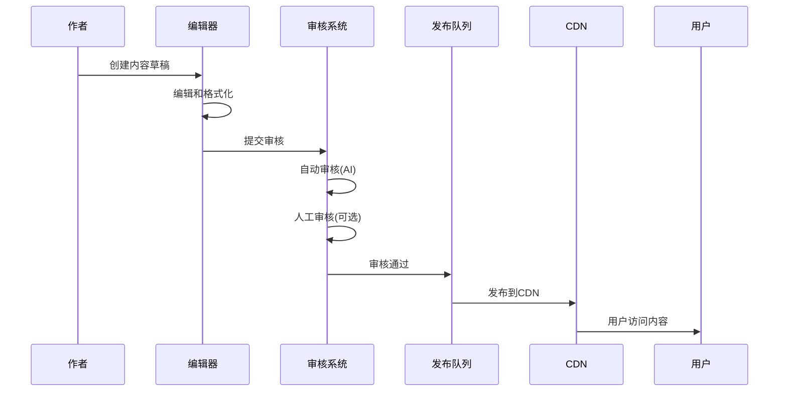
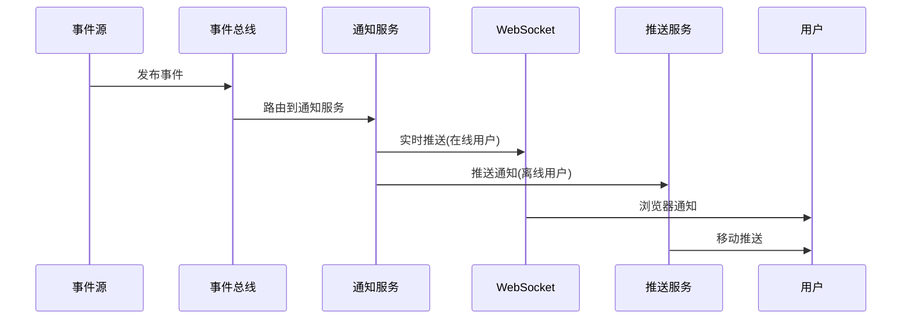
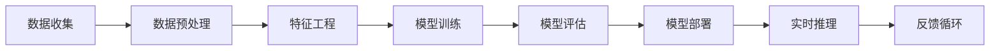

# 技术架构设计文档

## 🏗️ 系统架构概览



## 🎯 设计原则

### 1. 可扩展性
- 微服务架构，支持水平扩展
- 无状态服务设计
- 异步处理和消息队列

### 2. 性能优化
- 边缘计算和CDN缓存
- 数据库读写分离
- 智能缓存策略

### 3. 可靠性
- 多区域部署
- 自动故障转移
- 监控和告警系统

### 4. 安全性
- 零信任安全模型
- 端到端加密
- 定期安全审计

## 📊 技术栈选择

### 前端技术栈
| 技术 | 版本 | 用途 | 优势 |
|------|------|------|------|
| Next.js | 14.x | 全栈框架 | SSR、ISR、API路由 |
| TypeScript | 5.x | 类型安全 | 更好的开发体验 |
| Tailwind CSS | 3.x | CSS框架 | 快速UI开发 |
| Framer Motion | 10.x | 动画库 | 流畅的动画效果 |
| React Query | 4.x | 状态管理 | 数据获取和缓存 |
| Zod | 3.x | 数据验证 | 运行时类型检查 |

### 后端技术栈
| 技术 | 版本 | 用途 | 优势 |
|------|------|------|------|
| Node.js | 18.x | 运行时 | 高性能、异步IO |
| PostgreSQL | 15.x | 主数据库 | ACID、JSON支持 |
| Redis | 7.x | 缓存/队列 | 高性能内存存储 |
| Prisma | 5.x | ORM | 类型安全的数据库访问 |
| BullMQ | 4.x | 任务队列 | 可靠的异步处理 |
| Socket.IO | 4.x | WebSocket | 实时通信 |

### 基础设施
| 服务 | 用途 | 优势 |
|------|------|------|
| Vercel | 部署平台 | 自动部署、边缘网络 |
| Cloudflare | CDN/DDoS防护 | 全球加速、安全防护 |
| Cloudinary | 媒体管理 | 图片优化、视频转码 |
| Sentry | 错误监控 | 实时错误追踪 |
| Datadog | 性能监控 | 全栈可观测性 |

## 🗄️ 数据库设计

### 核心数据模型

```sql
-- 用户系统
CREATE TABLE users (
    id UUID PRIMARY KEY,
    email VARCHAR(255) UNIQUE NOT NULL,
    username VARCHAR(50) UNIQUE NOT NULL,
    avatar_url TEXT,
    bio TEXT,
    preferences JSONB,
    created_at TIMESTAMP DEFAULT NOW(),
    updated_at TIMESTAMP DEFAULT NOW()
);

-- 游戏内容
CREATE TABLE games (
    id UUID PRIMARY KEY,
    title VARCHAR(255) NOT NULL,
    slug VARCHAR(255) UNIQUE NOT NULL,
    description TEXT,
    cover_image_url TEXT,
    release_date DATE,
    developer VARCHAR(255),
    publisher VARCHAR(255),
    platforms JSONB,
    genres JSONB,
    metadata JSONB,
    created_at TIMESTAMP DEFAULT NOW()
);

-- 新闻文章
CREATE TABLE articles (
    id UUID PRIMARY KEY,
    title VARCHAR(255) NOT NULL,
    slug VARCHAR(255) UNIQUE NOT NULL,
    excerpt TEXT,
    content TEXT NOT NULL,
    cover_image_url TEXT,
    author_id UUID REFERENCES users(id),
    category VARCHAR(50),
    tags JSONB,
    status VARCHAR(20) DEFAULT 'draft',
    published_at TIMESTAMP,
    views INTEGER DEFAULT 0,
    likes INTEGER DEFAULT 0,
    created_at TIMESTAMP DEFAULT NOW(),
    updated_at TIMESTAMP DEFAULT NOW()
);

-- 评论系统
CREATE TABLE comments (
    id UUID PRIMARY KEY,
    content TEXT NOT NULL,
    user_id UUID REFERENCES users(id),
    article_id UUID REFERENCES articles(id),
    parent_id UUID REFERENCES comments(id),
    likes INTEGER DEFAULT 0,
    created_at TIMESTAMP DEFAULT NOW(),
    updated_at TIMESTAMP DEFAULT NOW()
);
```

### 索引策略
- 主键使用UUID v7（时间有序）
- 频繁查询字段建立索引
- 复合索引优化关联查询
- 全文搜索使用Elasticsearch

## 🔄 数据流设计

### 内容发布流程


### 实时通知流程


## 🚀 性能优化策略

### 1. 前端优化
- **代码分割**: 按路由动态加载
- **图片优化**: WebP格式、懒加载
- **字体优化**: 字体子集、预加载
- **缓存策略**: Service Worker、LocalStorage

### 2. 后端优化
- **数据库**: 连接池、查询优化
- **缓存**: Redis多级缓存
- **CDN**: 静态资源全球分发
- **压缩**: Brotli/Gzip压缩

### 3. 网络优化
- **HTTP/2**: 多路复用、头部压缩
- **QUIC**: 快速连接建立
- **边缘计算**: 靠近用户的处理

## 🔒 安全架构

### 认证授权
- **OAuth 2.0**: 第三方登录
- **JWT**: 无状态认证
- **RBAC**: 基于角色的访问控制
- **2FA**: 双因素认证

### 数据安全
- **加密**: TLS 1.3、数据库字段加密
- **备份**: 自动备份、异地容灾
- **审计**: 操作日志、数据变更追踪

### 应用安全
- **输入验证**: 防止XSS、SQL注入
- **速率限制**: API调用限制
- **WAF**: Web应用防火墙

## 📈 监控和运维

### 监控指标
- **应用性能**: 响应时间、错误率
- **基础设施**: CPU、内存、磁盘
- **业务指标**: 用户活跃、内容发布
- **安全指标**: 攻击尝试、异常登录

### 告警策略
- **实时告警**: 关键服务异常
- **预测告警**: 趋势分析预警
- **分级告警**: 不同级别通知

### 运维工具
- **基础设施即代码**: Terraform
- **容器编排**: Kubernetes
- **CI/CD**: GitHub Actions
- **配置管理**: Ansible

## 🌐 国际化架构

### 多语言支持
- **内容翻译**: 人工+AI翻译
- **日期格式**: 本地化显示
- **货币转换**: 实时汇率
- **RTL支持**: 从右到左语言

### 区域化内容
- **内容策略**: 区域特定内容
- **合规要求**: GDPR、CCPA
- **支付方式**: 本地支付集成

## 🤖 AI集成架构

### 智能功能
- **内容推荐**: 个性化推荐算法
- **自动摘要**: 文章自动摘要
- **情感分析**: 评论情感分析
- **聊天助手**: AI客服机器人

### 机器学习管道


## 📅 开发路线图

### Phase 1: MVP (1-2个月)
- 基础内容管理系统
- 用户认证系统
- 响应式前端界面

### Phase 2: 核心功能 (2-3个月)
- 社区功能
- 实时通知
- 搜索功能

### Phase 3: 高级功能 (3-4个月)
- AI集成
- 国际化
- 移动应用

### Phase 4: 扩展优化 (持续)
- 性能优化
- 安全加固
- 新功能开发

## 📋 部署检查清单

### 生产环境检查
- [ ] 环境变量配置
- [ ] 数据库备份设置
- [ ] SSL证书配置
- [ ] CDN配置
- [ ] 监控告警设置
- [ ] 安全扫描完成
- [ ] 性能测试通过
- [ ] 灾难恢复计划

### 上线流程
1. 预发布环境验证
2. 金丝雀发布（10%流量）
3. A/B测试验证
4. 全量发布
5. 监控和优化

---

*最后更新: 2026-03-19*  
*版本: 1.0.0*  
*文档状态: 草案*